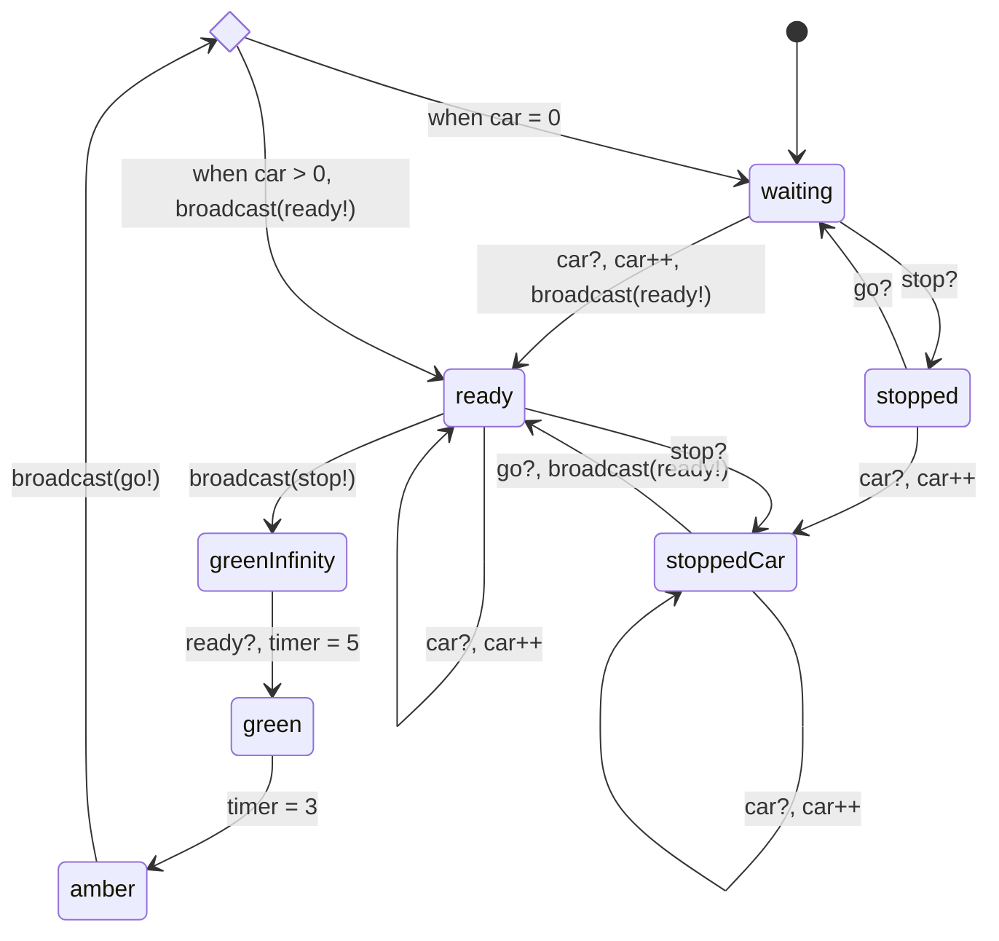

## Stream A reflection
I believe that my specification was quite complex, however, after implementing, there were several simplifications made. These simplifications were primarily *removing* the use of channels, and using shared state instead. I found that the use of channels lead to very complex states, whereas the use of shared state was much simpler. This did reduce the amount of states in my system, however, the important states, that is, the states that users of the traffic light will be able to see, were all kept. Moreover, the key aspects of the SCATS system were maintained.

**First Implementation**
My first implementation of the system was done through channels. This lead to many more states than expected, and I ran into issues of running out of processes in promela as each state was modelled as its own process. An example of how this worked is below:

```python
proctype Red(int light; chan c)
{
	if
	:: atomic { c?[CAR]; c!car -> run StoppedRed(light, c); }
	:: ....
	fi;
}
```

As seen above, I would simply run the next state. I quickly realised after running this program that this would lead to hundreds of processes being made and run. However, this was a big learning experience as it helped me figure out how promela actually worked! Moreover, this actually seemed worked until it ran out of processes.

**Second Implementation**
I again used channels, but made signle larger `TrafficLight`, `PedestrianLight` and `Signal` process. States were modelled using `goto` where transitions would take the form of:

```shell
state_1:
if
:: ...check -> goto state_0;
:: else -> goto state_1;
fi;
..
```

This implementation was functionally identical to my earlier one, which did seem to work. To test this model, I made a `Safety` thread that makes assertions, e.g.:

```python
proctype Safety()
{
	# this just checks that both lights are not green at the same time.
	assert(states[1] != RED && State[0] != RED);
}
```

However, after running this model, it actually failed this assertions after a few seconds every time. I've coppied my original state diagram below to explain why:



What happened is that the `Ready->GreenInfinity` transition had no requirement. This lead to a race condition where multiple lights could follow this transition at the same time. The solution was this had 2 steps.

*1. Make sure that the stop? transition if prioritised*
Originally I had the `(1)` condition for the above transition as I had directly translated it from my diagram. This means that it would simply take this transition whenever. I changed this to `else`, meaning it would check all the other possible options, and only do the `GreenInfinity` transition if all else were not possible.

*2. Make the whole `if` statement atomic*
This essentially means going from:
```shell
if
:: condition -> action
fi;
```
to
```shell
if
:: atomic { condition -> action }
fi;
```

together, this did solve my problem! However, in this time I realised a simpler implementation that would be easier to model check on. Specifically, to check on the number of cars as this was a challenge in my original implementation.

**Third Implementation**
This time, I used more global states, and removed the use of channels and messages entirely:
```python
mtype = { RED, GREEN, AMBER };

int Cars[2] = { 0, 0 };
mtype LStates[2] = RED;

int Peds[2] = { 0, 0 };
mtype PStates[2] = RED;
```

This lead to a simpler, easier to understand implementation that still modelled SCATS as in my specification. It also made it much easier to check things like Cars and States naturally, rather than these things being added on just for the `Safety` process. Originally, I ran into an issue where multiple lights would be green at the same time as earlier. The cause was also very similar, Light 1 would see Light 0 is red and turn green, in the meantime, Light 0 would see Light 1 is red and also turn green. My original solution was actually to use a lock:
```python
bool lock = false;
inline AquireLock()
{
	bool tmp = false;
	do
	:: atomic
	{
		tmp = lock;
		lock = true;
	} ->
		if
		:: tmp;
		:: else -> break;
		fi;
	od;
}

inline ReleaseLock()
{
	lock = false;
}
```

This is so only 1 light can enter the critical section at a time. This was an interesting exersize, however I realised I could achieve the same with just the use of atomic.

At this point, I just added in the rest of my safety thread, including for the pedestrian lights:
```python
proctype Safety() {
	do
	// Perpendicular lights should not be on at the same time
	:: assert(!(LStates[0] == GREEN && LStates[1] == GREEN));
	:: assert(!(LStates[0] == AMBER && LStates[1] == AMBER));
	:: assert(!(LStates[0] == AMBER && LStates[1] == GREEN));
	:: assert(!(LStates[0] == GREEN && LStates[1] == AMBER));
	
	// Perpendicular pedestrian and traffic lights should not be on at the same time
	:: assert(!(PStates[0] == GREEN && LStates[1] == GREEN));
	:: assert(!(PStates[1] == GREEN && LStates[0] == GREEN));
	od
}
```

This could also easily be a never statement too.
I believe that this lines up with a low HD (85-90) because:
- my initial system model and details were in depth, well-researched, and complex
- my implementation took several iterations and failures, and lead to a lot of promela learning. In the end, it did model my original system correctly.
- my final implementation did satisfy all requirements

## Stream B assessment
I made an attempt at everything, although the attempt at the very last HD task was not very good. I have not gotten distinction feedback yet, but I believe I went sufficiently into depth, and made a strong attempt. It did take me several attempts for the P and C tasks, however Mark's feedback was super helpful and I got it all eventually.

Overall I think this lines up with a high D or low HD (83-87?).

## Reflections on the unit
Through this unit, I have learnt how to model systems in promela, model real life systems with structures, design and evaluate CTL/LTL formulae, and much more. I've developed my ability to self-learn, and learn from formatif feedback. Overall, this has been a very interesting course, and I hope to do more research and study of formal verification in my free time in the future.

## Overall Assessment
All together, I think I line up with about a low HD mark (83 - 90) for the pre assessment work.