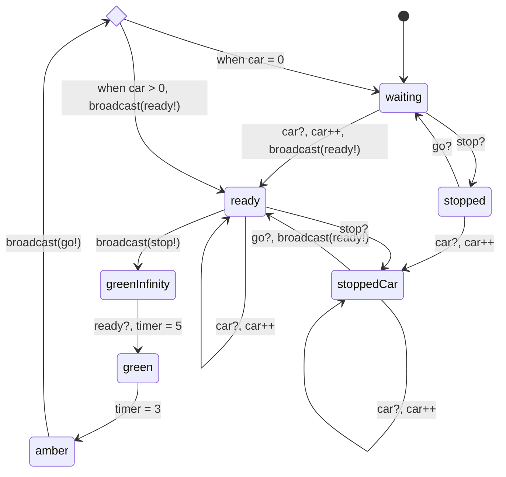

## Stream A reflection
I believe that my specification was quite complex, however, after implementing, there were several simplifications made. These simplifications were primarily *removing* the use of channels, and using shared state instead. I found that the use of channels lead to very complex states, whereas the use of shared state was much simpler. This did reduce the amount of states in my system, however, the important states, that is, the states that users of the traffic light will be able to see, were all kept. Moreover, the key aspects of the SCATS system were maintained.

**First Implementation**
My first implementation of the system was done through channels. This lead to many more states than expected, and I ran into issues of running out of processes in promela as each state was modelled as its own process. An example of how this worked is below:

```python
proctype Red(int light; chan c)
{
	if
	:: atomic { c?[CAR]; c!car -> run StoppedRed(light, c); }
	:: ....
	fi;
}
```

As seen above, I would simply run the next state. I quickly realised after running this program that this would lead to hundreds of processes being made and run. However, this was a big learning experience as it helped me figure out how promela actually worked! Moreover, this actually seemed worked until it ran out of processes.

**Second Implementation**
I again used channels, but made signle larger `TrafficLight`, `PedestrianLight` and `Signal` process. States were modelled using `goto` where transitions would take the form of:

```shell
state_1:
if
:: ...check -> goto state_0;
:: else -> goto state_1;
fi;
..
```

This implementation was functionally identical to my earlier one, which did seem to work. To test this model, I made a `Safety` thread that makes assertions, e.g.:

```python
proctype Safety()
{
	# this just checks that both lights are not green at the same time.
	assert(states[1] != RED && State[0] != RED);
}
```

However, after running this model, it actually failed this assertions after a few seconds every time. I've coppied my original state diagram below to explain why:



What happened is that the `Ready->GreenInfinity` transition had no requirement. This lead to a race condition where multiple lights could follow this transition at the same time. The solution was this had 2 steps.

**1. Make sure that the stop? transition if prioritised**
Originally I had the `(1)` condition for the above transition as I had directly translated it from my diagram. This means that it would simply take this transition whenever. I changed this to `else`, meaning it would check all the other possible options, and only do the `GreenInfinity` transition if all else were not possible.

**2. Make the whole `if` statement atomic**
This essentially means going from:
```shell
if
:: condition -> action
fi;
```
to
```shell
if
:: atomic { condition -> action }
fi;
```

together, this did solve my problem! However, in this time I realised a simpler implementation that would be easier to model check on. Specifically, to check on the number of cars as this was a challenge in my original implementation.
## self-assessment
I did not complete all HD tasks (e.g. stream B HD was not 100% completed), however, I made a strong attempt at all tasks regardless of grade, and did complete HD tasks for Stream A. I also did spend many many hours learning and programming promela, and made my system effectively. I did have to change my implementation from using signals to using shared arrays, however this did not change the important states, and importantly actually worked.

I believe that this lines up with a low HD (85-90) or a higher D (80-90).

## reflections on the unit
Through this unit, I have learnt how to model systems in promela, model real life systems with structures, design and evaluate CTL/LTL formulae, and much more. I've developed my ability to self-learn, and learn from formatif feedback. Overall, this has been a very interesting course, and I hope to do more research and study of formal verification in my free time in the future.