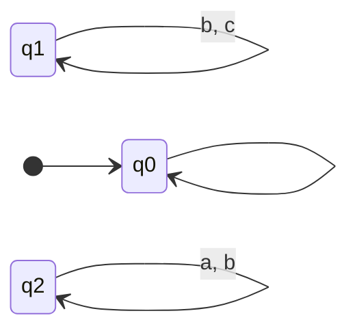

## B.1
![[Pasted image 20241110180404.png]]
#### Part A
![[Pasted image 20241110181246.png]]
p1, p2 has:
- q12

p1, not p2 has:
- q10

not p1, p2 has:
- q11
- q02
- q20
- q21
- q22

not p1, not p2 has:
- q00
- q01
#### Part B
![[Pasted image 20241110182542.png]]

p1, p2, not p3 has:
- q12

p1, not p2, p3 has:
- q10

not p1, p2, p3 has:
- q11
- q20
- q21
- q22

not p1, p2, not p3 has:
- q02

not p1, not p2, not p3 has:
- q00
- q01

## B.2
$$(\textbf{GF}a) \rightarrow (\textbf{FG}\neg c)$$
that is, if a is to occur infinitely, then eventually c will never occur again

## B.3
We have the formula 
$$(\textbf{GF}a) \rightarrow (\textbf{FG}\neg c)$$
We can replace $\textbf{G}a$ with $\neg\textbf{F}\neg a$ so we have
$$(\neg \textbf{F}\neg(\textbf{F}a))\implies(\textbf{F}(\neg\textbf{F}c))$$
We can replace $a\implies b$ with $\neg a \vee b$, giving us
$$\neg(\neg\textbf{F}\neg(\textbf{F}a))\vee(\textbf{F}(\neg\textbf{F}c))$$
Simplifying we have
$$\textbf{F}\neg(\textbf{F}a)\vee(\textbf{F}(\neg\textbf{F}c))$$
Lets consider $\textbf{F}\neg(\textbf{F}a)$. $\textbf{F}a$ means that eventually a occur. $\neg\textbf{F}a$ means that a will not occur. $\textbf{F}\neg(\textbf{F}a)$ means that eventually $a$ will never occur again.

Next lets consider $\textbf{F}(\neg\textbf{F}c)$. $\neg\textbf{F}c$ means that $c$ will not occur. $\textbf{F}(\neg\textbf{F}c)$ means that eventually $c$ will never occur again.

So we have that either eventually $a$ will never occur or eventually $c$ will never occur.

Then replace $G$ with

![[Pasted image 20241110180018.png]]