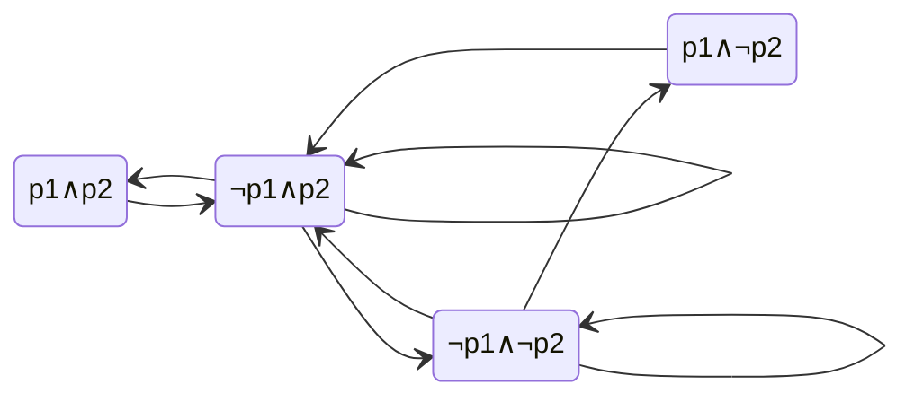
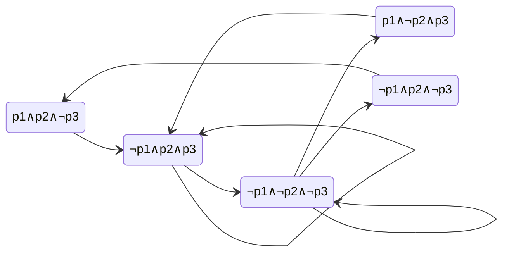

## B.1
![[Pasted image 20241110180404.png]]
#### Part A

![[Pasted image 20241110181246.png]]

#### Part B

p1, p2, not p3 has:
- q12

p1, not p2, p3 has:
- q10

not p1, p2, p3 has:
- q11
- q20
- q21
- q22

not p1, p2, not p3 has:
- q02

not p1, not p2, not p3 has:
- q00
- q01

## B.2
$$(\textbf{GF}a) \rightarrow (\textbf{FG}\neg c)$$
that is, if a is to occur infinitely, then eventually c will never occur again

## B.3
![[Pasted image 20241110180018.png]]