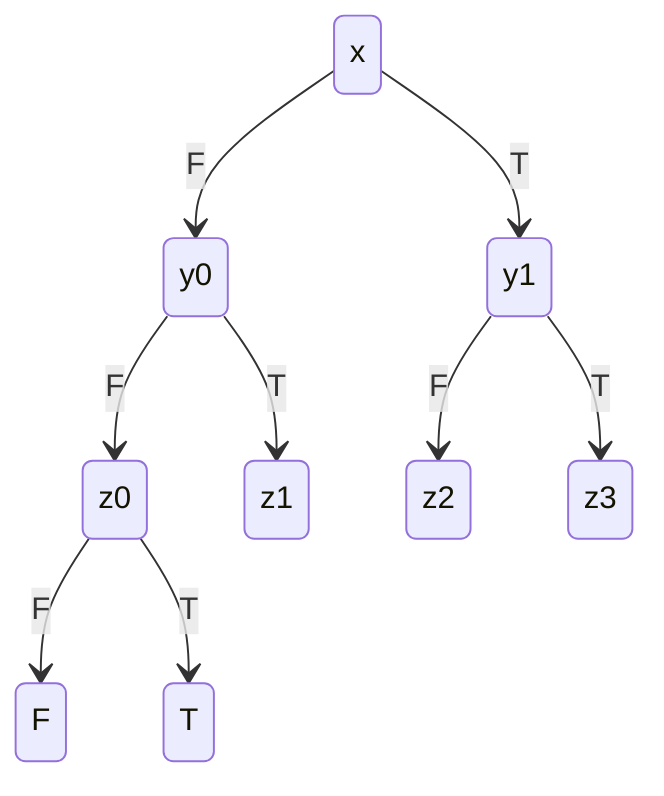

## B.1
![[Pasted image 20241110134915.png]]

## B.2
![[Pasted image 20241110152103.png]]

#### Part a
1. **XX**b
that is
- after 2 steps from $q_0$
- contains $b$ in its proposition set
*Not satisfied.* Consider $q_0$ -> $q_1$ -> $q_2$, where $q_2$ does not have $b$ in its proposition set.

2. a**U**c
that is
- starting from $q_0$
- $a$ is contained in proposition set on until we reach $c$

*This is satisfied* because the only 2 states with $c$ are $q2, q5$. When reaching $q2$, we must come from $q1, q_0$, which has $a$ in its proposition set. When reaching $q5$, we must come from $q2, q_1, q_0$, which also has $a$ in its proposition set set. So, regardless of how we reach a state with $c$ in its proposition set, we will have satisfied $a$ on the way.

3. **GF**b
that is, $b$ occurs infinitely often.

*This is satisfied*, it can be seen by noting that $q4$ is part of every cycle and will always eventually be reached. As such $b$ will occur infinitely often.

#### Part b
1. **AXEX**b
that is, for all states:
- for all paths
- after 1 step
- there exists a path
- after 1 step
- contains b in the proposition set

*Not satisfied*

We can ignore the first **AX** as we are able to reach any state after 1 step. So we have the formula that *for all paths, there exists a path that after one satisfies b*.
We can see that this is not true for state $q_1$, which has one path that leads to state $q_2$ which does not have $b$ in its proposition set. Therefore, this is not satisfied.

2. **E**a**U**c
that is, for all states:
- there exists $a$ path
- that satisfies $a$ before it satisfies $c$

*Not satisfied*

This cannot be satisfied because when starting from $q_5$, no paths can satisfy $a$ until $c$ since $q_5$ does not have $c$ in its proposition set.

3. **EGAF**b
that is, for all states:
- there exists a path
- for each state in the path
- for all paths
- eventually the path will satisfy $b$

*This is satisfied*

This problem is equivalant to *for all states, for all paths, paths will eventually satisfy b*. $q4$ is part of every cycle and will always eventually be reached. As such $b$ will eventually occur for all paths from all states.

## B.3
a) paths that contain at least two a:
$$F(a\wedge\textbf{F}a)$$

b) paths that contain at least one a before the first b; We can rewrite this as *we do not encounter a $b$ before $a$* which can be expressed as:
$$\neg b \cup a$$

c) paths that eventually do not contain a c. that is, eventually, c will never again be satisfied, we can express this as: 
$$\textbf{FG}\neg c$$

## B.4
Construct an OBDD for $f(x, y, z) = (x ∨ y ∨ z) ∧ (¬x ∨ ¬y ∨ ¬z)$

**Table**

| x   | y   | z   | (x ∨ y ∨ z) ∧ (¬x ∨ ¬y ∨ ¬z) |
| --- | --- | --- | ---------------------------- |
| F   | F   | F   | F                            |
| F   | F   | T   | T                            |
| F   | T   | F   | T                            |
| F   | T   | T   | T                            |
| T   | F   | F   | T                            |
| T   | F   | T   | T                            |
| T   | T   | F   | T                            |
| T   | T   | T   | F                            |

**Diagram**

