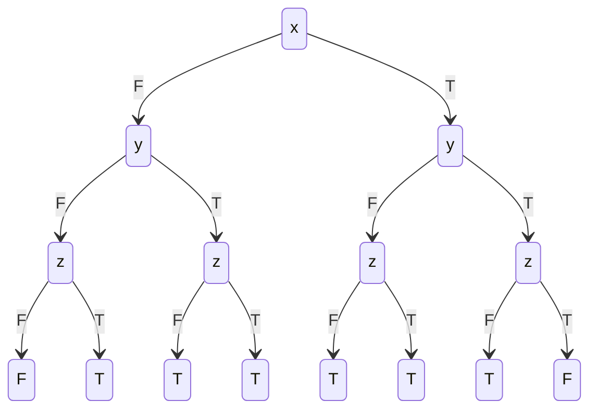

## B.1
![[Pasted image 20241111211751.png]]
we start at q1 which represents the odd position. Here, we only accept b and c moving to q2. Once at q2, which represents the even position, we can also accept a to go pack to the odd position.

For example, with string 'abc' starting at q1, we cannot go anywhere as the odd position does not accept a.  
  
With string 'bac', we accept b to go to q2, then accept a to go to q1, then accept c to go back to q2
## B.2
![[Pasted image 20241110152103.png]]

#### Part a
1. **XX**b
that is, for all starting paths from $q_0$
- after 2 steps
- satisfies $b$

*Not satisfied.*

Consider $q_0$ -> $q_1$ -> $q_2$, where $q_2$ does not have $b$ in its proposition set.

2. a**U**c
that is, for all paths starting from $q_0$
- $a$ is satisfied in all steps until we reach $c$

*This is not satisfied.*

Consider the cycle $q_0 \rightarrow q_1 \rightarrow q_4 \rightarrow q_0$. If this cycle were to occur infinitely, we would never satisfy $c$, and as such we would never satisfy $a\textbf{U}c$.

3. **GF**b
that is, for all paths starting from $q_0$, $b$ occurs infinitely often.

*This is satisfied*, it can be seen by noting that $q4$ is part of every cycle and will always eventually be reached. As such $b$ will occur infinitely often.

#### Part b
1. **AXEX**b
that is, starting from $q_0$
- for all paths
- after 1 step
- there exists a path
- after 1 step
- contains b in the proposition set

*This is satisfied*

The only path from $q_0$ in one step is to get to $q_1$. As such, we can simplify our requirements to *from $q_0$, there exists a path after 1 step that contains $b$ in the proposition set*. We can see that after 1 step from $q_0$, we can arrive at $q_4$ which has $b$ in its proposition set. As such, we have satisfied the LTL formula.

2. **E**a**U**c
that is, from $q_0$:
- there exists $a$ path
- that satisfies $a$ before it satisfies $c$

*This is satisfied*

The path starting from $q_0$:  $q_0 \rightarrow q_1 \rightarrow q_2$ satisfies $a$ until

3. **EGAF**b
that is, for all states:
- there exists a path
- for each state in the path
- for all paths
- eventually the path will satisfy $b$

*This is satisfied*

This problem is equivalant to *for all states, all paths will eventually satisfy b*. $q4$ is part of every cycle and will always eventually be reached. As such $b$ will eventually occur for all paths from all states.

## B.3
a) paths that contain at least two a:
$$\textbf{F}a \wedge (\textbf{F}a \implies \textbf{F}a)$$
That is, $a$ is satisfied eventually, and $a$ being satisfied implies that $a$ will be satisfied eventually. Thus, $a$ must be satisfied eventually at least twice.

b) paths that contain at least one a before the first b; We can rewrite this as *we do not encounter a $b$ before $a$ if we encounter an a eventually* which can be expressed as.
$$\textbf{F}a \implies \neg b \textbf{U} a$$
Here, if we encounter an $a$, then we must meet the condition that we do not encounter any $b$s until $a$.

c) paths that eventually do not contain a c. that is, eventually, c will never again be satisfied, we can express this as: 
$$\textbf{FG}\neg c$$

## B.4
Construct an OBDD for $f(x, y, z) = (x ∨ y ∨ z) ∧ (¬x ∨ ¬y ∨ ¬z)$

**Table**

| x   | y   | z   | (x ∨ y ∨ z) ∧ (¬x ∨ ¬y ∨ ¬z) |
| --- | --- | --- | ---------------------------- |
| F   | F   | F   | F                            |
| F   | F   | T   | T                            |
| F   | T   | F   | T                            |
| F   | T   | T   | T                            |
| T   | F   | F   | T                            |
| T   | F   | T   | T                            |
| T   | T   | F   | T                            |
| T   | T   | T   | F                            |

**Diagram**

**Full OBDD**

**ROBDD**
![[Pasted image 20241112202021.png]]
![[Pasted image 20241112202028.png]]