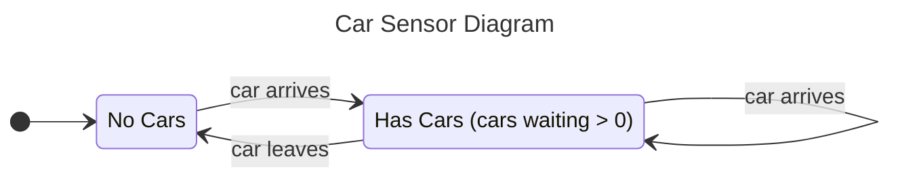
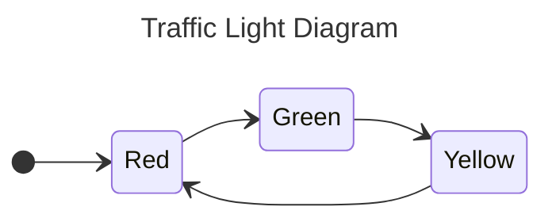
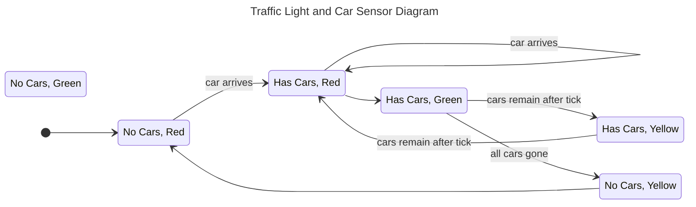

## SCATS - Sydney Coordinated Adaptive Traffic System

## Overview

> [!info] For more information about [SCATS](https://en.wikipedia.org/wiki/Sydney_Coordinated_Adaptive_Traffic_System)

I propose to model a traffic light system based on SCATS. Unfortunately, SCATS will not show me they're proprietary algorithm, so I will be making a simplified estimation based on experience and research. The traffic light system will run on a common, *small* intersection setup as below:

![[COMP3153 Exalidraw.excalidraw|1000px]]
> [!note] For simplicity, cars can only cross straight.

## Key Components

> [!INFO] This will be run on a tick based simulation, where a tick is analogous to a second.

#### Car Sensor

#### Traffic Light
Traffic lights ONLY turn green when there are cars waiting to go. Additionally, traffic lights stay green for 1 tick, in which 1 car may go. After 1 tick, they turn yellow, after that tick they turn red. 

> [!INFO] Tick order of green/yellow traffic light:
> 1. Cars randomly arrive.
> 	1. If a car arrives at a green or yellow light, and there are no cars at that light, it may immediately go.
> 	2. If a car arrives at a green or yellow light, it must wait in the queue.
> 2. The first car leaves.
> 3. Cars shuffle up the queue.
> 4. The sensor updates its state, if there are cars waiting it remains as `Has Cars`, otherwise it turns to `No Cars`.
> 5. The traffic light changes and we return to step 1 for the yellow signal.

> [!NOTE] All transitions below occur on a tick.

### Implementation Details
This will be run on a tick based simulation, where a tick is analogous to a second. We will have some random non-deterministic variables:
1. Cars arriving at each intersection. For example, we can choose to have a 20% chance of a car arriving at any intersection each tick.
2. Pedestrians arriving at each crossing. For example, we can choose to have a 10% chance of a pedestrian arriving at any crossing with the intent of travelling some direction (there are 8 choices here).

We also have some additional states here as a result of entities in our system taking action:
1. Cars crossing / remaining stationary.
2. Pedestrians crossing / remaining stationary.

Some safety properties we can validate here include:
1. No perpendicular traffic lights should be green or amber simultaneously.
2. Pedestrian lights must be red if an opposing traffic light is green.

Some liveliness properties we can validate here include:
1. Cars must be able to cross within 5 minutes of arrival.
2. All pedestrians must eventually be able to cross the road.

### Extensibility
1. Previously I mentioned that cars can only cross the intersection straight. We can introduce a new traffic light which enables cars to cross left and right as well. This will **significantly** increase complexity. However, will lead to a more useful model. **My aim is to validate such a system in the end!**. This also leads to more safety properties to validate for pedestrians and cars. However, this also leads to a two lane road, which undoubtably may increase complexity too much.
2. As an add on to the above, or more likely, an alternative: The open green light with turns allowed. In such a light, cars may cross right and left, buy only if there is no other cars or pedestrians impeding their path. This is very interesting, as it may lead to certain scenarios where a crossing is bottle necked by cars turning right.