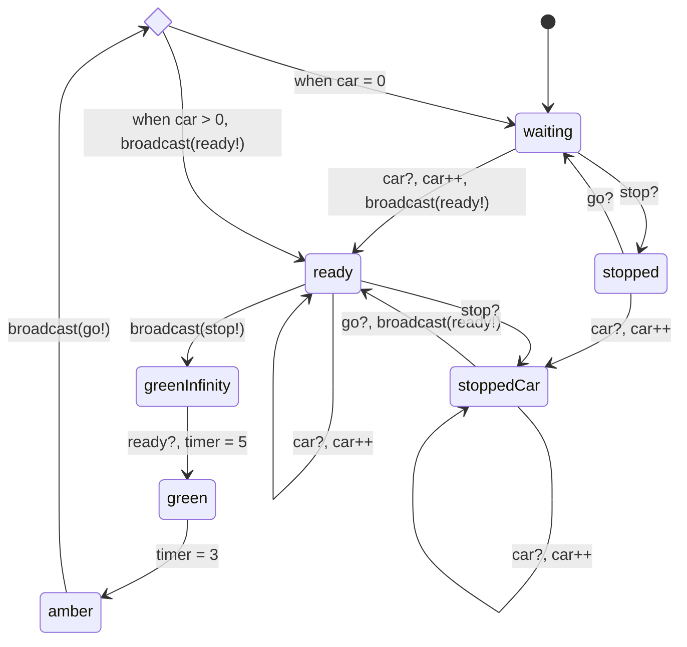
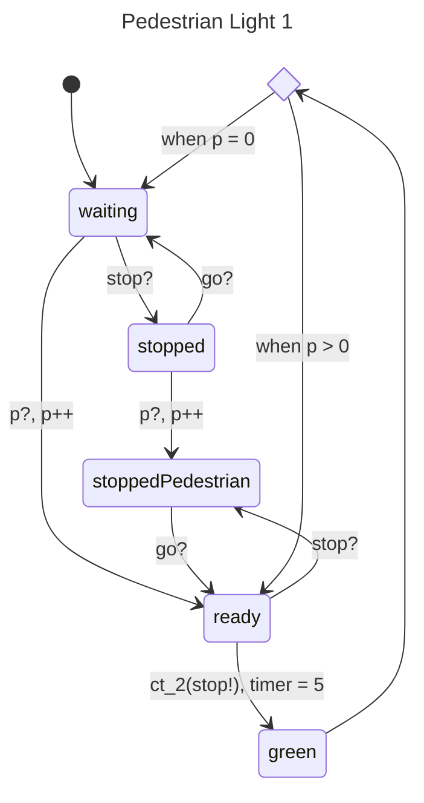

# SCATS - Sydney Coordinated Adaptive Traffic System

## Overview

> [!info] For more information about [SCATS](https://en.wikipedia.org/wiki/Sydney_Coordinated_Adaptive_Traffic_System)

I propose to model a traffic light system based on SCATS. Unfortunately, SCATS will not show me they're proprietary algorithm, so I will be making a simplified estimation based on experience and research. The traffic light system will run on a common, *small* intersection setup as below:

![[COMP3153 Exalidraw.excalidraw|1000px]]
For simplicity, cars can only cross straight.

## Implementation Details
### Non-determinism
This will be run on a tick based simulation, where a tick is analogous to a second. We will have some random non-deterministic variables:
1. Cars arriving at each intersection. For example, we can choose to have a 20% chance of a car arriving at any intersection each tick.
2. Pedestrians arriving at each crossing. For example, we can choose to have a 10% chance of a pedestrian arriving at any crossing with the intent of travelling some direction (there are 8 choices here).
### State Diagrams
#### Channels
We will have a channel for each traffic light $t_1, t_2, t_3, t_4$ named $ct_1, ct_2, ct_3, ct_4$. We also have channels for each pair of pedestrian lights named $pc_1, pc_2, pc_3, pc_4$.
- Let the `broadcast(signal)` function send `signal` to all channels.
- Let the `ct_x(signal)` function send `signal` to $ct_x$. E.g. the `ct_1(signal!)` sends signal `signal!` to $ct_1$. Same with function `pc_x(signal)`.
#### Simplification
We can simplify the 4 traffic lights + 4 pedestrian lights into 2 pairs of traffic lights and pedestrian lights. This is because when a traffic light is activated, so too can the opposing traffic light be activated.
As such, we can simplify our channels into:
- $ct_1, ct_2$ where $ct_1$ serves a pair of opposing traffic lights and $ct_2$ represents the perpendicular pair of traffic lights.
- similarly $pc_1, pc_2$.
#### Car Sensor
Every time a car arrives, the car sensor emits the `car` signal to its corresponding traffic light. I.e. $car\_sensor_i$ will emit `ct_i(car)`.
#### Traffic Light
**Variables**
`uint car = 0;`
`uint timer = 0;`
Every tick in the `green`, `greenInfinity`, and `amber` states, the `car` and `timer` variables are decremented by 1.

**Signals**
- *stop*: indicates a traffic light has turned green
- *ready*: indicates a traffic light is ready to go. Note that every state consumes the `ready` signal looping back to itself unless another transition is specified. For simplicity, I have not added this to the below diagram.
- *car*: indicates a car has arrived
- *go*: indicates a traffic light has finished being green and another may go

#### Pedestrian Signal
Whenever the pedestrian button is clicked, we will send a `p` signal to the corresponding pedestrian light pair.
#### Pedestrian Light
Although there are 8 pedestrian lights, we can reduce this 2 pairs of perpendicular pedestrian lights. In the end, we have a state diagram very similar to that of traffic lights.

## Specification
### Safety Properties
1. No perpendicular traffic lights should be green or amber simultaneously.
2. Pedestrian lights must be red if an opposing traffic light is green.
3. The system never results in a deadlock where no cars/pedestrians may cross.
### Liveliness Properties
1. 
## Extensibility
1. Previously I mentioned that cars can only cross the intersection straight. We can introduce a new traffic light which enables cars to cross left and right as well. This will **significantly** increase complexity. However, will lead to a more useful model. **My aim is to validate such a system in the end!**. This also leads to more safety properties to validate for pedestrians and cars.
2. As an add on to the above, or more likely, an alternative: The open green light with turns allowed. In such a light, cars may cross right and left, buy only if there is no other cars or pedestrians impeding their path. This is very interesting, as it may lead to certain scenarios where a crossing is bottle necked by cars turning right.