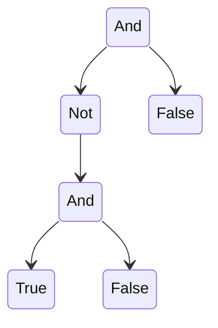

> [!link] https://cgi.cse.unsw.edu.au/~cs3161/24T3/Assignment%200/Spec.pdf

> [!warning] TODOS
> - [x] 📅 2024-10-01 Figure out induction
> - [ ] 📅 2024-10-04 Finish this damn assignment (COMP3161 ass 0)
## Part A
### 1
> Write down a set of inference rules that define the set P. The rules may be ambiguous. *(5 marks)*

$$\frac{}{True}, \frac{}{False}, \frac{p \space P}{\neg p}, \frac{p \space P}{(p)}, \frac{p_1 \space P \space p_2 \space P}{p_1 \wedge p_2}$$
### 2
> The operator ¬ has the highest precedence, and logical and is right-associative. Define a set of simultaneous judgements to define the language without any ambiguity. *(5 marks)*

$$\frac{}{True \ P_{atom}}, \frac{}{False \ P_{atom}}, \frac{p \ P_{and}}{(p) P_{atom}}$$
$$\frac{p \ P_{atom}}{p \ P_{not}}, \frac{p \ P_{atom}}{\neg p \ P_{not}}$$
$$\frac{p \ P_{not}}{p \ P_{and}}, \frac{p_1 \ P_{not} \ p_2 \ P_{and}}{p_2 \wedge p_2 \ P_{and}}$$

### 3
> Here is an abstract syntax B for the same language: `B ::= Not B | And B B | True | False` Write an inductive definition for the parsing relation connecting your unambiguous judgements to this abstract syntax. *(5 marks)*

$$\frac{}{True \ P_{atom} \longleftrightarrow True \ B}, \frac{}{False \ P_{atom} \longleftrightarrow False \ B}$$
$$\frac{p \ P_{atom} \longleftrightarrow b \ B}{p \ P_{brac} \longleftrightarrow b \ B}, \frac{p \ P_{atom} \longleftrightarrow b \ B}{(p) \ P_{brac} \longleftrightarrow b \ B}$$
$$\frac{p \ P_{brac} \longleftrightarrow b \ B}{p \ P_{and} \longleftrightarrow b \ B}, \frac{p_1 \ P_{brac} \ p_2 \ P_{and} \longleftrightarrow a \ B \ b \ B}{p_2 \wedge p_2 \ P_{and} \longleftrightarrow AND \ a \ b \ B}$$
$$\frac{p \ P_{and} \longleftrightarrow b \ B}{p \ P_{not} \longleftrightarrow b \ B}, \frac{p \ P_{and} \longleftrightarrow b \ B}{\neg p \ P_{not} \longleftrightarrow NOT \ b \ B}$$
### 4
#### a)
> Show the evaluation of `And (Not (And True False)) False` with a derivation tree (arguably this belongs in Part B). (5 marks)



#### b)
> Consider the following inference rule: $$\frac{x ⇓ v}{Not \ x ⇓ v^{-1}}$$ where we understand $v^{-1}$ to be defined by the following equations:
> $$True^{-1} = False$$
> $$False^{-1} = True$$
> Is this rule derivable? Is it admissible? Justify your answers. *(5 marks)*

Lets call this new inference rule $N_x$. Suppose $x$ evaluates to $True$. Then
$$\frac{x \Downarrow  v = True}{Not \ x \Downarrow v^{-1} = False} \equiv N_1$$
Suppose $x$ evaluates to $False$. Then
$$\frac{x \Downarrow  v = False}{Not \ x \Downarrow v^{-1} = True} \equiv N_2$$
So in all cases, the conclusion of $N_x$ can be derived from rules $N_1$ and $N_2$, so $N_x$ is derivable. Thus, it must also be admissible.

## Part B
$$\frac{c → c′}{(If \ c \ t \ e) → (If c′ \ t \ e)}(1)$$
$$\frac{}{(If \ True \ t \ e) → t}(2)$$
$$\frac{}{(If \ False \ t \ e) → e}(3)$$
### 1
> Show the full evaluation of the term `(If True (If False True False) False)`. *(5 marks)*

```python
(If True (If False True False) False)
(If False True False) <- using 2, evaluate (If False True False) to True
(False) <- using 3
```

### 2
> Define an equivalent big-step semantics for L. *(5 marks)*

$$\frac{c \Downarrow \text{False} \ \ \ t \Downarrow t' \ \ \ f \Downarrow f'}{(\text{If} \ c \ t \ f) \Downarrow f'}(4)$$
$$\frac{c \Downarrow \text{True} \ \ \ t \Downarrow t' \ \ \ f \Downarrow f'}{(\text{If} \ c \ t \ f) \Downarrow t'}(5)$$


### 3
> Prove that if $e \Downarrow v$ then $e \overset{*}{\mapsto} v$, where $\Downarrow$ is the big-step semantics you defined in the previous question, and $\overset{*}{\mapsto}$ is the reflexive and transitive closure of $\mapsto$. Use rule induction on $e \Downarrow v$. *(10 marks)*

> [!info] Let $P(e)$ be $e \Downarrow v \text{ implies } e \overset{*}{\mapsto} v$.

**Base Case**
The base cases are $P(True)$ and $P(False)$.

*Case 1*
$e = True$. Both big and small step semantics have no steps, so both evaluate to $True$.

*Case 2*
$e = False$. Both big and small step semantics have no steps, so both evaluate to $False$.

So $P(e)$ is true when $e \in \{True, False\}$.

**Lemma 1**
Prove that if $a \Downarrow a'$ then $\text{If} \ a \ b \ c \overset{*}{\mapsto} \text{If} \ a' \ b \ c$.

*Base Case*
If $a = True$ then we know $a \Downarrow True$, and it must be true that $\text{If} \ True \ b \ c \overset{*}{\mapsto} \text{If} \ True \ b \ c$ after 0 steps.

If $a = False$ then we know $a \Downarrow False$, and it must be true that $\text{If} \ False \ b \ c \overset{*}{\mapsto} \text{If} \ False \ b \ c$ after 0 steps.

*Inductive Hypothesis*
Assume that if $a \Downarrow a'$ then $\text{If} \ a \ b \ c \overset{*}{\mapsto} \text{If} \ a' \ b \ c$.

*Inductive Case*
Prove that if $a_{-1} \Downarrow a'$, and $a_{-1} \mapsto a$, then $\text{If} \ a_{-1} \ b \ c \overset{*}{\mapsto} \text{If} \ a' \ b \ c$.

Lets start with expression $$\text{If} \ a_{-1} \ b \ c$$
It is given that $a_{-1} \mapsto a$, so we can apply small step rule 1
$$\frac{a_{-1} \mapsto a}{\text{If} \ a_{-1} \ b \ c \mapsto \text{If} \ a \ b \ c}$$
From our inductive hypothesis, we know that $\text{If} \ a_{-1} \ b \ c \overset{*}{\mapsto} \text{If} \ a \ b \ c$.

$$\frac{\text{If} \ a_{-1} \ b \ c \mapsto \text{If} \ a \ b \ c \ \ \ \ \ \ \text{If} \ a \ b \ c \overset{*}{\mapsto} \text{If} \ a' \ b \ c}{\text{If} \ a_{-1} \ b \ c \overset{*}{\mapsto} \text{If} \ a' \ b \ c}$$

Hence, if true for $a$, true for $a_{-1}$ where $a_{-1} \mapsto a$.

*Conclusion Lemma 1*
Therefore, by mathematical induction, if $a \Downarrow a'$ then $\text{If} \ a \ b \ c \overset{*}{\mapsto} \text{If} \ a' \ b \ c$.

**Inductive Case**
*Case 1*
$P(\text{If} \ e \ t \ f)$ when $e \Downarrow True$. With inductive hypothesis $P(t)$ and $P(f)$.

First lets evaluate this expression using big step semantic 4
$$\frac{e \Downarrow \text{True} \ \ \ t \Downarrow t' \ \ \ f \Downarrow f'}{(\text{If} \ e \ t \ f) \Downarrow t'}(4)$$

We know from *lemma 1* that given $e \Downarrow True$, then $\text{If} \ e \ t \ f \overset{*}{\mapsto} \text{If} \ True \ t \ f$. Next, $\text{If True} \ t \ f \mapsto t$ using small step 2. Using the inductive hypothesis $P(t)$, we know $t \Downarrow t' \implies t \overset{*}{\mapsto} t'$. Since $\text{If} \ e \ t \ f \overset{*}{\mapsto} \text{If} \ True \ t \ f \mapsto t \overset{*}{\mapsto} t'$, and $\overset{*}{\mapsto}$ is transitive, we know that $\text{If} \ e \ t \ f \overset{*}{\mapsto} t'$. Therefore, $P(\text{If} \ e \ t \ f)$ holds true when $e \Downarrow True$.

*Case 2*
$P(\text{If} \ e \ t \ f)$ when $e \Downarrow False$. With inductive hypothesis $P(t)$ and $P(f)$.

First lets evaluate this expression using big step semantic 5
$$\frac{e \Downarrow \text{False} \ \ \ t \Downarrow t' \ \ \ f \Downarrow f'}{(\text{If} \ e \ t \ f) \Downarrow f'}(4)$$

We know from *lemma 1* that given $e \Downarrow False$, then $\text{If} \ e \ t \ f \overset{*}{\mapsto} \text{If} \ False \ t \ f$. Next, $\text{If False} \ t \ f \mapsto f$ using small step 3. Using the inductive hypothesis $P(f)$, we know $t \Downarrow f' \implies f \overset{*}{\mapsto} f'$. Since $\text{If} \ e \ t \ f \overset{*}{\mapsto} \text{If} \ False \ t \ f \mapsto f \overset{*}{\mapsto} f'$, and $\overset{*}{\mapsto}$ is transitive, we know that $\text{If} \ e \ t \ f \overset{*}{\mapsto} f'$. Therefore, $P(\text{If} \ e \ t \ f)$ holds true when $e \Downarrow False$.

**Conclusion**
So if $P(e)$, then $P(\text{If} \ \text{True} \ t \ f)$ and $P(\text{If} \ \text{False} \ t \ f)$. Therefore, by induction, $P(e)$ holds in all cases.

## Part C
### 1
> Define a recursive compilation function c : B → L which converts expressions in B to expressions in L. *(5 marks)*

``` haskell
c :: B -> L
c (Not b) = (If (c b) False True) <- c1
c (And a b) = (If (c a) (c b) False) <- c2
c True = True <- c3
c False = False <- c4
```

### 2
> Prove that $\forall e, \ e \Downarrow v \ \text{implies} \ c(e) ⇓ v$, by rule induction on the assumption that $e \Downarrow v$. *(10 marks)*

> [!info] Let $P(e)$ be $e \Downarrow v \text{ implies } c(e) \Downarrow v$.

**Base Case**
Prove $P(True)$ and $P(False)$.

1. $True \Downarrow True$ and $c(True) = True$ (using c3) so $P(True)$ is true.
1. $False \Downarrow False$ and $c(False) = False$ (using c4) so $P(False)$ is true.

**Inductive Case**
*Case 1*
Prove $P(\text{Not} \ e)$ with inductive hypothesis $P(e)$, specifically, assume $e \Downarrow v \implies c(e) \Downarrow v$.

1. If $e \Downarrow True$, then $\text{Not} \ e \Downarrow False$, and $c(\text{Not} \ e)$:
```haskell
c(Not e) = (If (c e) False True) <- using c1
		 = (If True False True) <- using inductive hypothesis
		 = False <- using language L small step (3)
```

2. If $e \Downarrow False$, $\text{Not} \ e \Downarrow True$, and $c(\text{Not} \ e)$:
```haskell
c(Not e) = (If (c e) False True) <- using c1
		 = (If False False True) <- using inductive hypothesis
		 = True <- using language L small step (2)
```

So if $P(e)$, then $P(\text{Not} \ e)$.

*Case 2*
Prove $P(\text{And} \ a \ b)$  with Inductive hypothesis:
1. Inductive hypothesis $P(a)$.
2. Inductive hypothesis $P(b)$.

Cases:
1. when $a \Downarrow False$, $b \Downarrow False$, $\text{And} \ a \ b \Downarrow False \ \text{using language B big step rule } N_5$. So, we must show that $c(\text{And} \ a \ b) \Downarrow False$
```haskell
c(And a b) = (If (c a) (c b) False) <- using c2
		   = (If False (c b) False) <- using inductive hypothesis 1
		   = (If False False False) <- using inductive hypothesis 2
		   = False <- using language L small step 3
```

2. when $a \Downarrow False$, $b \Downarrow True$, $\text{And} \ a \ b \Downarrow False \ \text{using language B big step rule } N_5$. So, we must show that $c(\text{And} \ a \ b) \Downarrow False$
```haskell
c(And a b) = (If (c a) (c b) False) <- using c2
		   = (If False (c b) False) <- using inductive hypothesis 1
		   = (If False True False) <- using inductive hypothesis 2
		   = False <- using language L small step 3
```

3. when $a \Downarrow True$, $b \Downarrow False$, $\text{And} \ a \ b \Downarrow False \ \text{using language B big step rule } N_6$. So, we must show that $c(\text{And} \ a \ b) \Downarrow False$
```haskell
c(And a b) = (If (c a) (c b) False) <- using c2
		   = (If True (c b) False) <- using inductive hypothesis 1
		   = (If True False False) <- using inductive hypothesis 2
		   = False <- using language L small step 2
```

4. when $a \Downarrow True$, $b \Downarrow True$, $\text{And} \ a \ b \Downarrow True\ \text{using language B big step rule } N_6$. So, we must show that $c(\text{And} \ a \ b) \Downarrow True$
```haskell
c(And a b) = (If (c a) (c b) False) <- using c2
		   = (If True (c b) False) <- using inductive hypothesis 1
		   = (If True True False) <- using inductive hypothesis 2
		   = False <- using language L small step 2
```

So if $P(a)$ and $P(b)$, then in all cases $P(\text{And} \ a \ b)$.

**Conclusion**
Therefore, by induction, $\forall e, e \Downarrow v \text{ implies } c(e) \Downarrow v$.
## Part D
### 1
> Here is a term in λ-calculus: $$(λn. λf. λx. (n f (f x))) (λf. λx. f x)$$
#### a)
> Fully β-reduce the above λ-term. Show all intermediate beta reduction steps. *(5 marks)*

```haskell
	(λn. λf. λx. (n f (f x))) (λf. λx. f x)
->A (λn. λf. λx. (n f (f x))) (λg. λp. g p) <- renaming variables f and x to g and p
->B (λf. λx. ((λg. λp. g p) f (f x))) <- replacing f with (λf. λx. f x)
->B (λf. λx. ((λp. f p) (f x))) <- replacing g with f
->B (λf. λx. (f (f x)) <- replacing p with (f x)
```
### b)
> Identify an η-reducible expression in the above (unreduced) term. *(5 marks)*

η-reducible refers to reduction using `(λx. f x) 7 ->η f`. This can be applied to the expression `(λf. λx. f x)`, specifically to `(λx. f x)`.
```haskell
	(λf. λx. f x)
=   (λf. (λx. f x)) <- adding brackets
->n (λf. (f)) <- using n reduction on (λx. f x)
=   (λf. f)
```

### 2
> Recall that in λ-calculus, booleans can be encoded as binary functions that return one of their arguments: $$T ≡ (λx. λy. x)$$$$F ≡ (λx. λy. y)$$
> Either via L or directly, define a function d : B → λ which converts expressions in B to λ-calculus. *(5 marks)*

``` haskell
d :: B -> λ
d True = T <- d_1
d False = F <- d_2
d (Not b) = (d b) F T <- d_3
d (And a b) = (d a) (d b) F <- d_4
```

### 3
> Prove that for all e such that $e \Downarrow v$ it holds that $d(e) \equiv_{abn}v′$, where $v′$ is the λ-calculus encoding of $v$. *(10 marks)*

> [!info] Let $P(e)$ be $e \Downarrow v \text{ implies } d(e) \equiv_{abn} v'$ where $v'$ is the $\lambda$-calculus encoding of $v$.

**Base Case**
Prove $d(True) \Downarrow T$ and $d(False) \Downarrow F$.
1. $d(True) = T$ using d_1
2. $d(False) = F$ using d_2

**Inductive Case**
*Case 1*
Prove $P(\text{Not} \ b)$ with inductive hypothesis $P(b)$. We have 2 cases, $b \Downarrow True$ and $b \Downarrow False$.

1. Consider $b \Downarrow True$:
Given $b \Downarrow True$ we know that $\text{Not} \ b \Downarrow False$. The equivalent to $False$ in $\lambda$-calculus encoding is $F$, so we must prove $d(\text{Not} \ b) \equiv F$. Now lets evaluate $d(\text{Not} \ b)$.
```haskell
d(Not b) = (d b) F T <- d_3
		 = T F T <- using inductive hypothesis, since b ↓ True, b ≡ T in λ-calculus.
		 = (λx λy x) F T <- definition of T
		 = F <- substituting x with F and y with T
```

1. Consider $b \Downarrow False$:
Given $b \Downarrow False$ we know that $\text{Not} \ b \Downarrow True$. The equivalent to $True$ in $\lambda$-calculus encoding is $T$, so we must prove $d(\text{Not} \ b) \equiv T$. Now lets evaluate $d(\text{Not} \ b)$.
```haskell
d(Not b) = (d b) F T <- d_3
		 = F F T <- using inductive hypothesis, since b ↓ False, b ≡ F in λ-calculus.
		 = (λx λy y) F T <- definition of F
		 = T <- subtituting x with F and y with T
```

So if $P(b)$, $P(\text{Not} \ b) \equiv_{abn} v'$ where $v'$ is the $\lambda$-encoding of $v$.

*Case 2*
Prove $P(\text{And} \ a \ b)$ with inductive hypothesis $P(a)$ and $P(b)$. We have 4 cases.

1. when $a \Downarrow False$, $b \Downarrow False$, show that $c(\text{And} \ a \ b) \Downarrow False$, so we must show $c(b) \equiv_{abn} F$ as below:
```haskell
d(And a b) = (d a) (d b) F <- d_4
		   = F (d b) F <- using inductive hypothesis P(a)
		   = F F F <- using inductive hypothesis P(b)
		   = (λx λy y) F F <- definition of F
		   = F <- substituting x with F and y with F
```

2. when $a \Downarrow False$, $b \Downarrow True$, show that $c(\text{And} \ a \ b) \Downarrow False$, so we must show $c(b) \equiv_{abn} F$ as below:
```haskell
d(And a b) = (d a) (d b) F <- d_4
		   = F (d b) F <- using inductive hypothesis P(a)
		   = F T F <- using inductive hypothesis P(b)
		   = (λx λy y) T F <- definition of F
		   = F <- substituting x with T and y with F
```

3. when $a \Downarrow True$, $b \Downarrow False$, show that $c(\text{And} \ a \ b) \Downarrow False$, so we must show $c(b) \equiv_{abn} F$ as below:
```haskell
d(And a b) = (d a) (d b) F <- d_4
		   = T (d b) F <- using inductive hypothesis P(a)
		   = T F F <- using inductive hypothesis P(b)
		   = (λx λy x) F F <- definition of T
		   = F <- substituting x with F and y with F
```

4. when $a \Downarrow True$, $b \Downarrow True$, show that $c(\text{And} \ a \ b) \Downarrow True$, so we must show $c(b) \equiv_{abn} T$ as below:
```haskell
d(And a b) = (d a) (d b) F <- d_4
		   = T (d b) F <- using inductive hypothesis P(a)
		   = T T F <- using inductive hypothesis P(b)
		   = (λx λy x) T F <- definition of T
		   = T <- substituting x with T and y with F
```

So if $P(a)$, and $P(b)$, $P(\text{And} \ a \ b) \equiv_{abn} v'$ where $v'$ is the $\lambda$-encoding of $v$.

**Conclusion**
Therefore, by induction, if $e \Downarrow v$ it holds that $d(e) \equiv_{abn}v′$, where $v′$ is the λ-calculus encoding of $v$.
## Part E
### 1
> Extend the abstract syntax for B from question A.3 so that it supports the features used in the above example. Use first-order abstract syntax with explicit strings. You don’t have to extend the parsing relation. *(5 marks)*

```haskell
B ::= Let String String B B | Var String | Call String B | Not B | And B B | True | False
```

### 2
$$\frac{\Gamma, y \ \text{bound} \vdash b_1 \text{ ok} \ \ \ \ \ \ \Gamma, x \ \text{bound} \vdash b_2 \text{ ok}}{\Gamma \vdash \text{Let} \ x \ y \ b_1 \ b_2 \ \text{ok}}$$
$$\frac{x \text{ bound} \in \Gamma}{\gamma \vdash \text{Var } x \ \text{ok}}$$
$$\frac{x \text{ bound} \in \Gamma \ \ \ \ \ \ \ \Gamma \vdash b \text{ ok}}{\Gamma \vdash \text{Call } x \ b \text{ ok}}$$
$$\frac{\Gamma \vdash b \text{ ok}}{\Gamma \vdash \text{Not } b \text{ ok}}$$
$$\frac{\Gamma \vdash b_1 \text{ ok} \ \ \ \ \ \Gamma \vdash b_2 \text{ ok}}{\Gamma \vdash \text{And } b_1 \ b_1 \text{ ok}}$$
$$\frac{}{\Gamma \vdash \text{True ok}}, \frac{}{\Gamma \vdash \text{False ok}}$$

If the same string is used to denote both a function name and a variable in the same scope, this is accepted by my scope judgement.

If the same string is used to denote another function name or variable as previously declared, this is also accepted by my scope judgement.