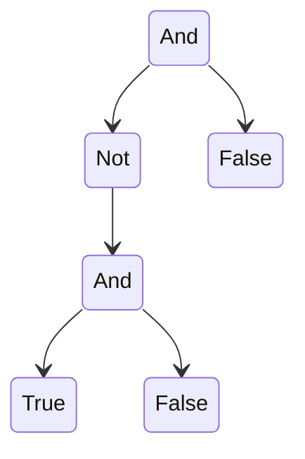

> [!link] https://cgi.cse.unsw.edu.au/~cs3161/24T3/Assignment%200/Spec.pdf

> [!warning] TODOS
> - [ ] 📅 2024-10-01 Figure out induction
> - [ ] 📅 2024-10-04 Finish this damn assignment (COMP3161 ass 0)
## Part A
### 1
> Write down a set of inference rules that define the set P. The rules may be ambiguous. *(5 marks)*

$$\frac{}{True}, \frac{}{False}, \frac{p \space P}{\neg p}, \frac{p \space P}{(p)}, \frac{p_1 \space P \space p_2 \space P}{p_1 \wedge p_2}$$
### 2
> The operator ¬ has the highest precedence, and logical and is right-associative. Define a set of simultaneous judgements to define the language without any ambiguity. *(5 marks)*

`!(...) and (!...)`

$$\frac{}{True \ P_{atom}}, \frac{}{False \ P_{atom}}$$
$$\frac{p \ P_{atom}}{p \ P_{brac}}, \frac{p \ P_{atom}}{(p) P_{brac}}$$
$$\frac{p \ P_{brac}}{p \ P_{and}}, \frac{p_1 \ P_{brac} \ p_2 \ P_{and}}{p_2 \wedge p_2 \ P_{and}}$$
$$\frac{p \ P_{and}}{p \ P_{not}}, \frac{p \ P_{and}}{\neg p \ P_{not}}$$

### 3
> Here is an abstract syntax B for the same language: `B ::= Not B | And B B | True | False` Write an inductive definition for the parsing relation connecting your unambiguous judgements to this abstract syntax. *(5 marks)*

$$\frac{}{True \ P_{atom} \longleftrightarrow True \ B}, \frac{}{False \ P_{atom} \longleftrightarrow False \ B}$$
$$\frac{p \ P_{atom} \longleftrightarrow b \ B}{p \ P_{brac} \longleftrightarrow b \ B}, \frac{p \ P_{atom} \longleftrightarrow b \ B}{(p) \ P_{brac} \longleftrightarrow b \ B}$$
$$\frac{p \ P_{brac} \longleftrightarrow b \ B}{p \ P_{and} \longleftrightarrow b \ B}, \frac{p_1 \ P_{brac} \ p_2 \ P_{and} \longleftrightarrow a \ B \ b \ B}{p_2 \wedge p_2 \ P_{and} \longleftrightarrow AND \ a \ b \ B}$$
$$\frac{p \ P_{and} \longleftrightarrow b \ B}{p \ P_{not} \longleftrightarrow b \ B}, \frac{p \ P_{and} \longleftrightarrow b \ B}{\neg p \ P_{not} \longleftrightarrow NOT \ b \ B}$$
### 4
#### a)
> Show the evaluation of `And (Not (And True False)) False` with a derivation tree (arguably this belongs in Part B). (5 marks)



#### b)
> [!danger] Look at [Link](https://cgi.cse.unsw.edu.au/~cs3161/24T3/Week%2002/02-LMN-followup.pdf)
> Consider the following inference rule: $$\frac{x ⇓ v}{Not \ x ⇓ v^{-1}}$$ where we understand $v^{-1}$ to be defined by the following equations:
> $$True^{-1} = False$$
> $$False^{-1} = True$$
> Is this rule derivable? Is it admissible? Justify your answers. *(5 marks)*

Suppose $x$ evaluates to $True$. Then
$$\frac{x \Downarrow  v = True}{Not \ x \Downarrow v^{-1} = False} \equiv N_1$$
Suppose $x$ evaluates to $False$. Then
$$\frac{x \Downarrow  v = False}{Not \ x \Downarrow v^{-1} = True} \equiv N_2$$
So in all cases, we may derive the inference rule from the given big steps semantics. As such, it is derivable and admissible.

## Part B
$$\frac{c → c′}{(If \ c \ t \ e) → (If c′ \ t \ e)}(1)$$
$$\frac{}{(If \ True \ t \ e) → t}(2)$$
$$\frac{}{(If \ False \ t \ e) → e}(3)$$
![[Pasted image 20240930192553.png]]
### 1
> Show the full evaluation of the term `(If True (If False True False) False)`. *(5 marks)*

```python
		-> (If True (If False True False) False)
using 2 -> (If False True False)
using 3 -> (False)
```

### 2
> Define an equivalent big-step semantics for L. *(5 marks)*

$$\frac{c \Downarrow \text{False} \ \ \ t \Downarrow t' \ \ \ f \Downarrow f'}{(\text{If} \ c \ t \ f) \Downarrow f'}(4)$$
$$\frac{c \Downarrow \text{True} \ \ \ t \Downarrow t' \ \ \ f \Downarrow f'}{(\text{If} \ c \ t \ f) \Downarrow t'}(5)$$


### 3
> [!danger] TODO REWORD
> Prove that if $e \Downarrow v$ then $e \overset{*}{\mapsto} v$, where $\Downarrow$ is the big-step semantics you defined in the previous question, and $\overset{*}{\mapsto}$ is the reflexive and transitive closure of $\mapsto$. Use rule induction on $e \Downarrow v$. *(10 marks)*

- Let $P(e)$ be $e \Downarrow v \text{ implies } e \overset{*}{\mapsto} v$.

**Base Case**
The base cases are $P(True)$ and $P(False)$.

*Case 1*, $e = True$. Both big and small step semantics has no steps, so both evaluate to $True$.
*Case 2*, $e = False$. Both big and small step semantics has no steps, so both evaluate to $False$.

So $P(e)$ is true when $e \in \{True, False\}$.

**Inductive Case**
*Case 1*
$P(\text{If} \ \text{True} \ t \ f)$ with $t \Downarrow t'$ and $f \Downarrow f'$. With inductive hypothesis $P(t)$.

Big step: $\text{If} \ \text{True} \ t \ f \Downarrow t'$. (Big step 4)

$\text{If True} \ t \ f \mapsto t$ (Small step 2). Using the inductive hypothesis, we know $t \Downarrow t' \implies t \overset{*}{\mapsto} t'$. So $\text{If True} \ t \ f \overset{*}{\mapsto} t'$.

*Case 2*
$P(\text{If} \ \text{False} \ t \ f)$ with $t \Downarrow t'$ and $f \Downarrow f'$. With inductive hypothesis $P(f)$.

Big step: $\text{If} \ \text{False} \ t \ f \Downarrow f'$. (Big step 4)

$\text{If False} \ t \ f \mapsto f$ (Small step 2). Using the inductive hypothesis, we know $t \Downarrow f' \implies f \overset{*}{\mapsto} f'$. So $\text{If False} \ t \ f \overset{*}{\mapsto} f'$.

**Conclusion**
So if $P(e)$, then $P(\text{If} \ \text{True} \ t \ f)$ and $P(\text{If} \ \text{False} \ t \ f)$. Therefore, by induction, $P(e)$ is true in all cases.

## Part C
### 1
> [!danger] This is correct but the formatting is certainly not
> Define a recursive compilation function c : B → L which converts expressions in B to expressions in L. *(5 marks)*

``` haskell
c :: B -> L
c (Not b) = (If (c b) False True) // c1
c (And a b) = (If (c a) (If (c b) True False) False) // c2
c True = True // c3
c False = False // c4

// example for (Not False)
	c (Not False)
->  (If (c False) False True)
->  (If False False True)
->  True
// So, c (Not False) evaluates to True (1)

// example for (Not True)
	c (Not True)
->  (If (c True) False True)
->  (If True False True)
->  False 

// example for (And True False)
	c (And True False)
->  (If (c True) (If (c False) True False) False)
->  (If True (If False True False) False)
->  (If True False False)
->  False

// example for (And False True)
	c (And False True)
->  (If (c False) (If (c True) True False) False)
->  (If False (If True True False) False)
->  (If False True False)
->  False

// example for (And True (Not False))
	(And True (Not False))
->  (If (c True) (If (c (Not False)) True False) False)
... from 1 we know that c (Not False) evaluates to True
->  (If (c True) (If True True False) False)
->  (If True (If True True False) False)
->  (If True True False)
->  True
```

### 2
> [!danger] TODO
> Prove that $\forall e, \ e \Downarrow v \ \text{implies} \ c(e) ⇓ v$, by rule induction on the assumption that $e \Downarrow v$. *(10 marks)*

- Let $P(e)$ be $e \Downarrow v \text{ implies } c(e) \Downarrow v$.

**Base Case**
Prove $P(True)$ and $P(False)$.

1. $True \Downarrow True$ and $c(True) = True$ (using c3) so $P(True)$ is true.
1. $False \Downarrow False$ and $c(False) = False$ (using c4) so $P(False)$ is true.

**Inductive Case**
*Case 1*
Prove $P(\text{Not} \ e)$ with inductive hypothesis $P(e)$, specifically, assume $e \Downarrow v \implies c(e) \Downarrow v$.

Big Step:
1. If $e \Downarrow True$, $\text{Not} \ e \Downarrow False$
2. If $e \Downarrow False$, $\text{Not} \ e \Downarrow true$.

Function c:
1. If $e \Downarrow True$
```haskell
c(Not e) = (If (c e) False True) <- using c1
		 = (If True False True) <- using inductive hypothesis
		 = False <- using language L small step (3)
```

2. If $e \Downarrow False$
```haskell
c(Not e) = (If (c e) False True) <- using c1
		 = (If False False True) <- using inductive hypothesis
		 = True <- using language L small step (2)
```

So if $P(e)$, then $P(\text{Not} \ e)$.

*Case 2*
Prove $P(\text{And} \ a \ b)$  with
1. Inductive hypothesis $P(a)$.
2. Inductive hypothesis $P(b)$.

Big Step:
1. when $a \Downarrow False$, $b \Downarrow False$, $\text{And} \ a \ b \Downarrow False \ \text{using language B big step rule } N_5$.
2. when $a \Downarrow False$, $b \Downarrow True$, $\text{And} \ a \ b \Downarrow False \ \text{using language B big step rule } N_5$.
3. when $a \Downarrow True$, $b \Downarrow False$, $\text{And} \ a \ b \Downarrow False \ \text{using language B big step rule } N_6$.
4. when $a \Downarrow True$, $b \Downarrow True$, $\text{And} \ a \ b \Downarrow True\ \text{using language B big step rule } N_6$.

Function c:
1. when $a \Downarrow False$, $b \Downarrow False$, show that $c(\text{And} \ a \ b) \Downarrow False$
```haskell
c(And a b) = (If (c a) (If (c b) True False) False) <- using c2
		   = (If False (If (c b) True False) False) <- using inductive hypothesis 1
		   = (If False (If False True False) False) <- using inductive hypothesis 2
		   = (If False False False) <- using language L small step 3
		   = False <- using language L small step 3
```

2. when $a \Downarrow False$, $b \Downarrow True$, show that $c(\text{And} \ a \ b) \Downarrow False$
```haskell
c(And a b) = (If (c a) (If (c b) True False) False) <- using c2
		   = (If False (If (c b) True False) False) <- using inductive hypothesis 1
		   = (If False (If True True False) False) <- using inductive hypothesis 2
		   = (If False True False) <- using language L small step 2
		   = False <- using language L small step 3
```

3. when $a \Downarrow True$, $b \Downarrow False$, show that $c(\text{And} \ a \ b) \Downarrow False$
```haskell
c(And a b) = (If (c a) (If (c b) True False) False) <- using c2
		   = (If True (If (c b) True False) False) <- using inductive hypothesis 1
		   = (If True (If False True False) False) <- using inductive hypothesis 2
		   = (If True False False) <- using language L small step 3
		   = False <- using language L small step 2
```

3. when $a \Downarrow True$, $b \Downarrow True$, show that $c(\text{And} \ a \ b) \Downarrow True$
```haskell
c(And a b) = (If (c a) (If (c b) True False) False) <- using c2
		   = (If True (If (c b) True False) False) <- using inductive hypothesis 1
		   = (If True (If True True False) False) <- using inductive hypothesis 2
		   = (If True True False) <- using language L small step 2
		   = False <- using language L small step 2
```

So if $P(a)$ and $P(b)$, then $P(\text{And} \ a \ b)$.

**Conclusion**
Therefore, by induction, $\forall e, e \Downarrow v \text{ implies } c(e) \Downarrow v$.
## Part D
### 1
> Here is a term in λ-calculus: $$(λn. λf. λx. (n f (f x))) (λf. λx. f x)$$
#### a)
> Fully β-reduce the above λ-term. Show all intermediate beta reduction steps. *(5 marks)*

```haskell
	(λn. λf. λx. (n f (f x))) (λf. λx. f x)
->A (λn. λf. λx. (n f (f x))) (λg. λp. g p) <- renaming variables f and x to g and p
->B (λf. λx. ((λg. λp. g p) f (f x))) <- replacing f with (λf. λx. f x)
->B (λf. λx. ((λp. f p) (f x))) <- replacing g with f
->B (λf. λx. (f (f x)) <- replacing p with (f x)
```
### b)
> Identify an η-reducible expression in the above (unreduced) term. *(5 marks)*

η-reducible refers to reduction using `(λx. f x) 7 ->η f`. This can be applied to the expression `(λf. λx. f x)`, specifically to `(λx. f x)`.
```haskell
	(λf. λx. f x)
=   (λf. (λx. f x)) <- adding brackets
->n (λf. (f)) <- using n reduction
=   (λf. f)
```

### 2
> Recall that in λ-calculus, booleans can be encoded as binary functions that return one of their arguments: $$T ≡ (λx. λy. x)$$$$F ≡ (λx. λy. y)$$
> Either via L or directly, define a function d : B → λ which converts expressions in B to λ-calculus. *(5 marks)*

``` haskell
d :: B -> λ
d True = T
d False = F
d (Not b) = (d b) F T
d (And a b) = (d a) ((d b) T F) F

e.g. B = (Not (And True False))

d (Not (And True False))
= (d (And True False)) F T
= ((d True) ((d False) T F) F) F T
= (T (F T F) F) F T
= (T F F) F T
= F F T
= T
```

### 3
> [!danger] TODO
> Prove that for all e such that e ⇓ v it holds that d (e) ≡αβη v′, where v′ is the λ-calculus encoding of v. *(10 marks)*

## Part E
### 1
> [!danger] TODO
> Extend the abstract syntax for B from question A.3 so that it supports the features used in the above example. Use first-order abstract syntax with explicit strings. You don’t have to extend the parsing relation. *(5 marks)*

> [!question] what does it mean by 'explicit strings'?

**Inference Rules:**
$$\frac{}{True}, \frac{}{False}, \frac{p \space P}{\neg p}, \frac{p \space P}{(p)}, \frac{p_1 \space P \space p_2 \space P}{p_1 \wedge p_2}$$
**New inference rules:**
	$$\frac{p_1 \ P \ \ \ p_2 \ P}{\textbf{let} \ \text{ident}\textbf{(}\text{ident}\textbf{)} = p_1 \ \textbf{in} \ p_2 \ \textbf{end}}$$
$$\frac{p \ P}{\text{ident}(p)}$$
$$\frac{}{\text{ident}}$$

### 2
> [!danger] TODO