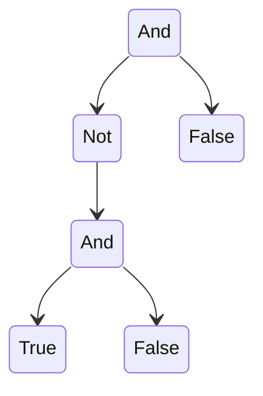

> [!link] https://cgi.cse.unsw.edu.au/~cs3161/24T3/Assignment%200/Spec.pdf

## Part A
### 1
> Write down a set of inference rules that define the set P. The rules may be ambiguous. *(5 marks)*

$$\frac{}{True}, \frac{}{False}, \frac{p \space P}{\neg p}, \frac{p \space P}{(p)}, \frac{p_1 \space P \space p_2 \space P}{p_1 \wedge p_2}$$
### 2
> The operator ¬ has the highest precedence, and logical and is right-associative. Define a set of simultaneous judgements to define the language without any ambiguity. *(5 marks)*

`!(...) and (!...)`

$$\frac{}{True \ P_{atom}}, \frac{}{False \ P_{atom}}$$
$$\frac{p \ P_{atom}}{p \ P_{brac}}, \frac{p \ P_{atom}}{(p) P_{brac}}$$
$$\frac{p \ P_{brac}}{p \ P_{and}}, \frac{p_1 \ P_{brac} \ p_2 \ P_{and}}{p_2 \wedge p_2 \ P_{and}}$$
$$\frac{p \ P_{and}}{p \ P_{not}}, \frac{p \ P_{and}}{\neg p \ P_{not}}$$

### 3
> Here is an abstract syntax B for the same language: `B ::= Not B | And B B | True | False` Write an inductive definition for the parsing relation connecting your unambiguous judgements to this abstract syntax. *(5 marks)*

$$\frac{}{True \ P_{atom} \longleftrightarrow True \ B}, \frac{}{False \ P_{atom} \longleftrightarrow False \ B}$$
$$\frac{p \ P_{atom} \longleftrightarrow b \ B}{p \ P_{brac} \longleftrightarrow b \ B}, \frac{p \ P_{atom} \longleftrightarrow b \ B}{(p) \ P_{brac} \longleftrightarrow b \ B}$$
$$\frac{p \ P_{brac} \longleftrightarrow b \ B}{p \ P_{and} \longleftrightarrow b \ B}, \frac{p_1 \ P_{brac} \ p_2 \ P_{and} \longleftrightarrow a \ B \ b \ B}{p_2 \wedge p_2 \ P_{and} \longleftrightarrow AND \ a \ b \ B}$$
$$\frac{p \ P_{and} \longleftrightarrow b \ B}{p \ P_{not} \longleftrightarrow b \ B}, \frac{p \ P_{and} \longleftrightarrow b \ B}{\neg p \ P_{not} \longleftrightarrow NOT \ b \ B}$$
### 4
#### a)
> Show the evaluation of `And (Not (And True False)) False` with a derivation tree (arguably this belongs in Part B). (5 marks)



#### b)
> Consider the following inference rule: $$\frac{x ⇓ v}{Not \ x ⇓ v^{-1}}$$ where we understand $v^{-1}$ to be defined by the following equations:
> $$True^{-1} = False$$
> $$False^{-1} = True$$
> Is this rule derivable? Is it admissible? Justify your answers. *(5 marks)*


> [!error] TODO

## Part B
### 1
> Show the full evaluation of the term `(If True (If False True False) False)`. *(5 marks)*

```python
	-> (If True (If False True False) False)
(2) -> (If False True False)
(3) -> (False)
```

### 2
> Define an equivalent big-step semantics for L. *(5 marks)*

$$\frac{t \Downarrow t' \ \ \ f \Downarrow f'}{(\text{If} \ \text{False} \ t \ f) \Downarrow f}$$
$$\frac{t \Downarrow t' \ \ \ f \Downarrow f'}{(\text{If} \ \text{True} \ t \ f) \Downarrow t}$$


### 3
> Prove that if $e \Downarrow v$ then $e \overset{*}{\mapsto} v$, where $\Downarrow$ is the big-step semantics you defined in the previous question, and $\overset{*}{\mapsto}$ is the reflexive and transitive closure of $\mapsto$. Use rule induction on $e \Downarrow v$. *(10 marks)*
